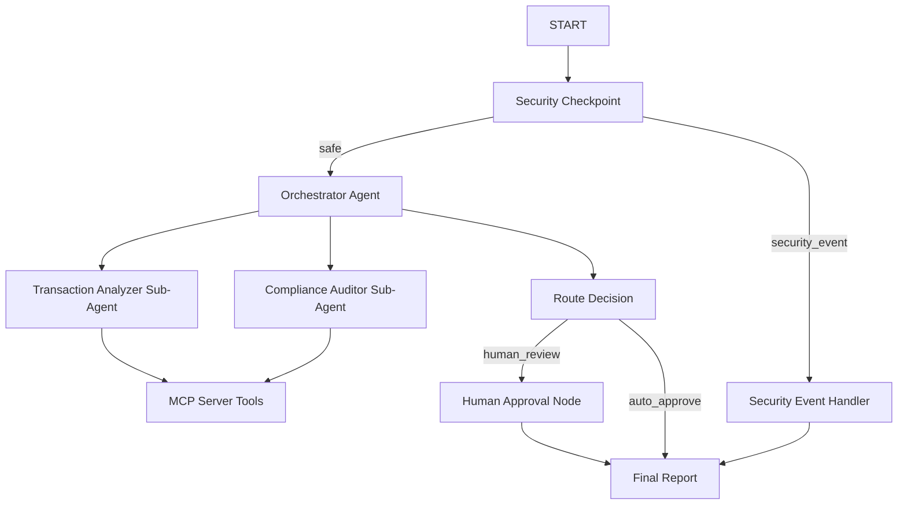

# Project Submission Write-Up — Audit Compliance Copilot

## Problem Statement
Corporate travel and expense policy audits are traditionally manual, labor-intensive, and slow. Compliance teams review thousands of transactions retroactively, leading to high operational overhead and delayed detection of policy violations, expense leaks, or fraudulent activities. An intelligent, automated audit copilot can scan transactions in real-time, enrich checks with organizational databases, protect privacy, flag potential violations, and escalate only anomalous cases for human review.

## Solution Architecture

## Concepts Used

This project leverages key concepts from the **Agent Development Kit (ADK)**:

1.  **ADK Workflow Graph API:** Graph routing is implemented in [app/agent.py](file:///c:/Users/nhien/Desktop/ADK-workspace/audit-compliance-copilot/app/agent.py#L191) using nodes (`FunctionNode`, `LlmAgent`) and structured edges.
2.  **LlmAgent Sub-Agents:** Specialized sub-agents like `transaction_analyzer` and `compliance_auditor` are declared in [app/agent.py](file:///c:/Users/nhien/Desktop/ADK-workspace/audit-compliance-copilot/app/agent.py#L42) to isolate responsibilities.
3.  **AgentTool Delegation:** The lead `orchestrator_agent` uses `AgentTool` in [app/agent.py](file:///c:/Users/nhien/Desktop/ADK-workspace/audit-compliance-copilot/app/agent.py#L90) to delegate sub-tasks to specialized sub-agents.
4.  **MCP Server Integration:** Local tool integration is built in [app/mcp_server.py](file:///c:/Users/nhien/Desktop/ADK-workspace/audit-compliance-copilot/app/mcp_server.py) and registered as an `McpToolset` in [app/agent.py](file:///c:/Users/nhien/Desktop/ADK-workspace/audit-compliance-copilot/app/agent.py#L59) for employees, policies, and logging.
5.  **Security Checkpoint Node:** Input validation, PII scrubbing, injection detection, and audit logging are implemented in the `security_checkpoint` FunctionNode in [app/agent.py](file:///c:/Users/nhien/Desktop/ADK-workspace/audit-compliance-copilot/app/agent.py#L101).
6.  **Agents CLI Scaffolding:** Scaffolded using `agents-cli scaffold create` and configured via `pyproject.toml` and `Makefile`.

## Security Design

The `security_checkpoint` node sits at the front of the graph and handles:
*   **PII Scrubbing:** Redacts Credit Card numbers and SSNs/Tax IDs using regular expressions.
*   **Prompt Injection Detection:** Inspects requests for prompt injection keywords (e.g., "ignore previous instructions", "override rules").
*   **Domain-Specific Anomaly Check:** Instantly blocks transactions over $50,000 or containing keywords associated with financial crimes (e.g. bribery, kickback).
*   **JSON Audit Logging:** Logs JSON metadata with timestamps and severity classification (`INFO`, `WARNING`, `CRITICAL`) to stderr.

## MCP Server Design

The Python MCP Server ([app/mcp_server.py](file:///c:/Users/nhien/Desktop/ADK-workspace/audit-compliance-copilot/app/mcp_server.py)) runs as a local stdio process exposing:
*   `get_corporate_policies`: Returns the active company expense guidelines.
*   `lookup_employee_allowance`: Resolves custom allowances based on employee work emails.
*   `log_audit_action`: Logs a persistent audit log entry of violations and overrides.

## Human-in-the-Loop (HITL) Flow

A `RequestInput` interrupt is created at `human_approval` in [app/agent.py](file:///c:/Users/nhien/Desktop/ADK-workspace/audit-compliance-copilot/app/agent.py#L162) if the risk assessment recommends human compliance review. This pauses execution and prompts the user in the playground UI for a yes/no confirmation, resuming only after receiving input.

## Demo Walkthrough

1.  **Case 1: Low-Risk Spend:** A $45 lunch for john.doe@company.com is checked against policies (Cap $200), finds no issues, and auto-approves.
2.  **Case 2: Prohibited flight:** A first-class flight booking ($1,200) by John Doe triggers a first-class policy violation, resulting in a risk flag and prompting the user in the UI for review.
3.  **Case 3: Exploit / Overflow attempt:** A transaction request for $75,000 combined with instructions to bypass safety rules is immediately blocked by the `security_checkpoint` node.

## Impact / Value Statement
Audit Compliance Copilot reduces the expense audit cycle from weeks to seconds. It filters out 90%+ of low-risk, compliant transactions via automation, allowing human compliance auditors to focus exclusively on high-risk, high-value anomalies. It guarantees policy adherence, prevents data leaks, and creates a transparent, tamper-proof JSON audit log.
